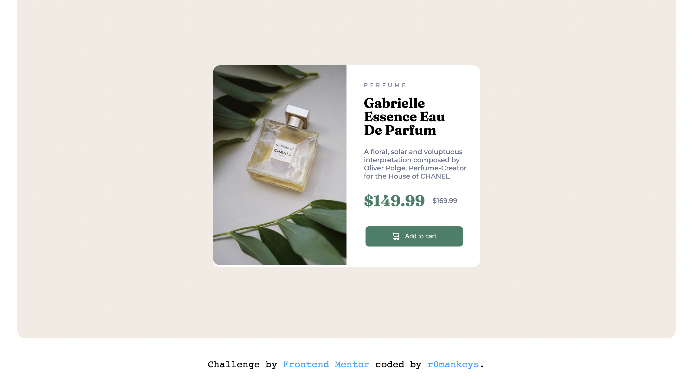

# Frontend Mentor - Product preview card component

This is a solution to the [Product preview card component challenge on Frontend Mentor](https://www.frontendmentor.io/challenges/product-preview-card-component-GO7UmttRfa).

## Table of contents 
 
  - [Overview](#overview)
    - [The challenge](#the-challenge)
    - [Screenshots](#screenshots)
    - [Links](#links)
 - [My process](#my-process)
   - [Built with](#built-with)
   - [What I learned](#what-i-learned) 
          - [Accessibility issues](#accessibility-issues)
          - [Helpesrs include](#helpers-include)
   - [Continued Development](#continued-development)
   - [Useful Resources](#useful-resources)
 - [Author](#author)

## Overview 

### The challenge

The challenge was to remake the webpage for both a desktop and mobile view, please see the design folder for the references I used for the page layout.

### Screenshots

|  |
| :--: |
| This is the desktop view of my clone website |

|  |
| :--: |
| This is the moblie view of my clone website |

### Links 

- Solution URL: [Solution on Frontend Mentor](https://www.frontendmentor.io/solutions/product-preview-card-xNHyyFab2F)
-  Live site URL [Live site hosted by Vercel](https://r0k-fem-challenge-2.vercel.app/)

## My process

### Built with 

- HTML 5
- CSS

### What I learned

During the process of building the webpage I brushed up on my knowlegde of media querries and the `content` attribute for CSS: 

```css
 element {
    content: url(https://example.com)
 }
```

> ***NOTE:** You can also link other areas of your project*
> 
> *e.g.* `url(images/image.jpg)`

This is actually how I solved an issue I was having with switching between the desktop image and the mobile image (while dont look like it they are two different images) for the respective views of the page.

I learned a lot after submitting the project as well. After looking at the report I found out I made some accesiblity and HTML issues in my code

#### Accessibility issues

- Page should contain a level-one heading
```html
<html lang='en'>
```

#### HTML issues 

- Should inlcued heading `h1-h6` to improve accessibillity

- `div` element not allowed as child of element `button` in the context it was used

I also learned a lot from people on Frontend Mentor who commented on my code and gave me very helpful feedback regarding ==semantic HTML== and remembering `alt` tags for my images

#### Helpers include 

- [Lucas 👾](https://www.frontendmentor.io/profile/correlucas)
- [バレンタイン](https://www.frontendmentor.io/profile/vcarames)

Definitley recommend checking them out on Frontend Mentor!

### Continued development

I plan to work on the feedback I recived both from the Frontend Mentor team and the people with profiles on Frontend Mentor 

Including: 
 
- Document and Website structure
- Semantic HTML 
- Accessibility 

I also plan on learning Javascript so I can add it to my websites for interactivity and eventually learn frameworks to make my code more refactorable. 

### Useful resources

- [MDN web docs](https://developer.mozilla.org/en-US/) - always an amazing resource to use when your stuck, very helpful for understanding media querries.
  
-  [W3 schools](https://www.w3schools.com/) - also an amzing resource to use when stuck, I used this when I was stuck with replacing the desktop image with the mobile iamge using  the `content: url()` attribute

## Author 

- Frontend Mentor: [r0mankeys](https://www.frontendmentor.io/profile/r0mankeys)


